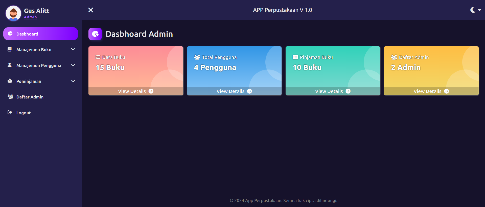

# **Aplikasi Perpustakaan**

Aplikasi perpustakaan berbasis web yang memungkinkan pengguna untuk meminjam, mengembalikan, dan melihat daftar buku. Aplikasi ini juga dilengkapi dengan panel admin untuk mengelola data buku, pengguna, dan peminjaman.

---

# **Tampilan Awal Aplikasi Perpustakaan Admin**


---

# **Tampilan Awal Aplikasi Perpustakaan User**


---

## **Daftar Isi**

1. [Fitur](#fitur)
2. [Instalasi](#instalasi)
3. [Penggunaan](#penggunaan)
   - [User](#user)
   - [Admin](#admin)
4. [Struktur Proyek](#struktur-proyek)
5. [Teknologi yang Digunakan](#teknologi-yang-digunakan)

---

## **Fitur**

### Fitur User:

- Registrasi dan login pengguna
- Peminjaman dan pengembalian buku
- Pencarian dan sorting buku
- Melihat riwayat peminjaman dan pengembalian buku
- Melihat detail buku

### Fitur Admin:

- Mengelola data buku (tambah, edit, hapus buku)
- Mengelola pengguna (tambah, edit, hapus pengguna)
- Melihat dan mengelola peminjaman dan pengembalian buku
- Statistik peminjaman dan pengembalian

---

## **Instalasi**

Langkah-langkah untuk menginstal proyek ini.

### 1. **Instal via Git**:

   ```bash
   git clone https://github.com/gusalitt/Aplikasi-Perpustakaan.git
   ```

### 2. **Instal via ZIP**:
   1. Klik [di sini](https://github.com/gusalitt/Aplikasi-Perpustakaan/archive/refs/heads/main.zip) untuk menginstal seluruh project dalam format zip.
   2. Lalu ekstrak file zip yang telah di instal.

---

## **Penggunaan**

### User:

- Registrasi: Pengguna dapat membuat akun baru melalui halaman registrasi.
- Login: Setelah registrasi, pengguna dapat login dan melihat katalog buku.
- Peminjaman Buku: Setelah login, pengguna dapat memilih buku yang tersedia dan meminjamnya.
- Pengembalian Buku: Pengguna dapat mengelola buku yang telah dipinjam dan mengembalikannya.
- Riwayat Peminjaman: Pengguna dapat melihat daftar buku yang sudah dipinjam dan dikembalikan.

### Admin:

- Registrasi: Admin dapat membuat akun baru melalui halaman registrasi.
- Login: Setelah registrasi, admin dapat login dan melihat halaman dashboard.
- Manejemen Buku: Admin dapat menambah, mengedit, dan menghapus buku dari database.
- Manejemen Pengguna: Admin dapat melihat dan mengelola data pengguna, termasuk menambah - atau menghapus akun pengguna.
- Melihat Riwayat Peminjaman: Admin dapat melihat riwayat peminjaman dan pengembalian buku oleh pengguna.

---

## **Struktur Proyek**

```bash
D:.
|
+---/admin <------------------------------------ # Folder Admin
|
|   +---/assets
|   |
|   |   +---/css
|   |   |   daftar.css
|   |   |   dasbhoard.css
|   |   |   login_daftar.css
|   |   |   responsive.css
|   |   |   style.css
|   |   |   tambah_buku.css
|   |   |   tambah_pengguna.css
|   |   |
|   |   +---/img
|   |   |   favicon.png
|   |   |   favicon2.png
|   |   |   home_admin.png
|   |   |   pp.svg
|   |   |
|   |   +---/js
|   |   |   script.js
|   |   |
|   +---/buku
|   |   daftar_buku.php
|   |   edit_buku.php
|   |   print_buku.php
|   |   tambah_buku.php
|   |
|   +---/manajemen_admin
|   |   daftar_admin.php
|   |   edit_admin.php
|   |   print_admin.php
|   |
|   +---/peminjaman
|   |   peminjaman_buku.php
|   |   pengembalian_buku.php
|   |   print_peminjaman.php
|   |   print_pengembalian.php
|   |
|   +---/pengguna
|   |   daftar_pengguna.php
|   |   edit_pengguna.php
|   |   print_pengguna.php
|   |   tambah_pengguna.php
|   |
|   daftar.php
|   dashboard.php
|   index.php
|   kelola_data.php
|   login.php
|   logout.php
|
+---/inc
|   connect.php
|
+---/user <------------------------------------- # Folder User
|
|   +---/assets
|   |
|   |   +---/css
|   |   |   detail_buku.css
|   |   |   home.css
|   |   |   koleksi_buku.css
|   |   |   login_daftar.css
|   |   |   profil.css
|   |   |   responsive.css
|   |   |   style.css
|   |   |   tentang_kami.css
|   |   |
|   |   +---/img
|   |   |   about-img.png
|   |   |   favicon.png
|   |   |   favicon2.png
|   |   |   hero.png
|   |   |   home_user.png
|   |   |   pp.svg
|   |   |
|   |   +---/js
|   |   |   script.js
|   |   |
|   +---/home
|   |   home.php
|   |
|   +---/koleksi_buku
|   |   detail_buku.php
|   |   koleksi_buku.php
|   |
|   +---/profil
|   |   detail_pengembalian.php
|   |   detail_pinjaman.php
|   |   profil.php
|   |
|   +---/tentang_kami
|   |   tentang_kami.php
|   |
|   daftar_user.php
|   index.php
|   kelola_data_buku.php
|   login_user.php
|   logout.php
|
perpustakaan.sql
README.md
```

---

## **Teknologi yang Digunakan**

- **Frontend:** HTML, CSS, JavaScript
- **Backend:** PHP
- **Database:** MySQL
